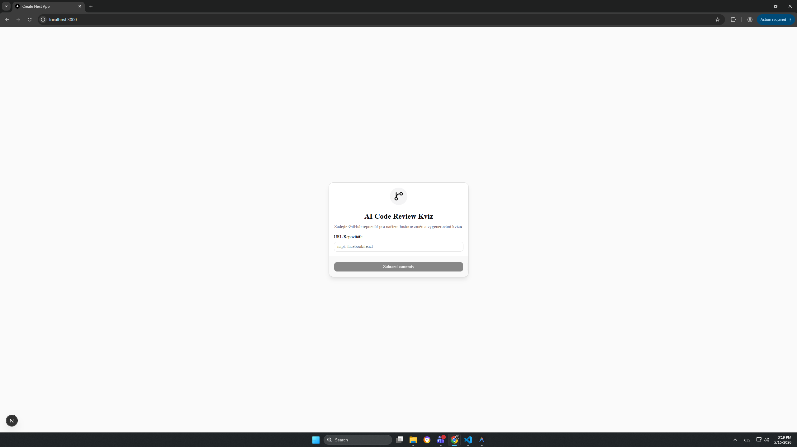
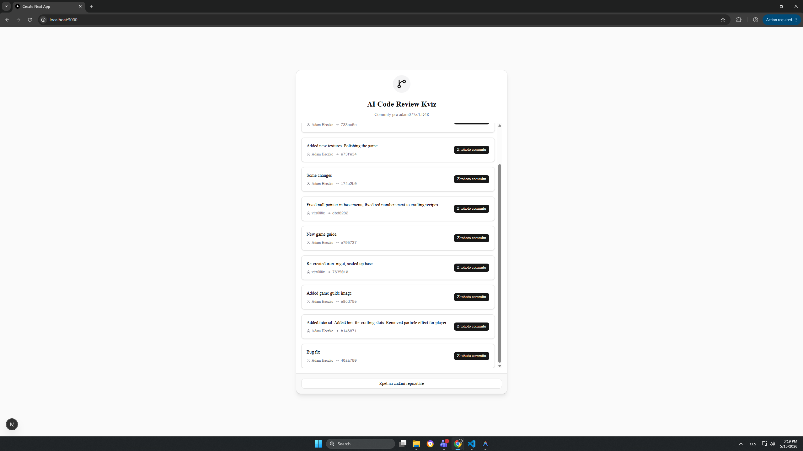
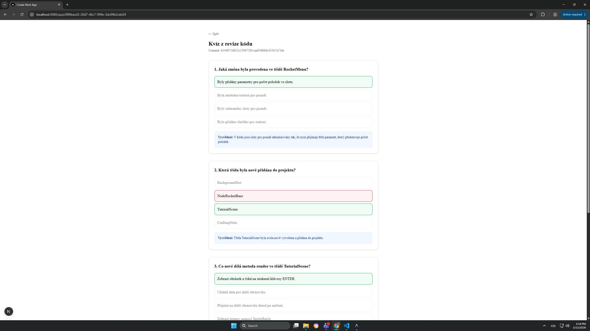

# AI Code Review Kvíz - Detailní Projektová Dokumentace

Tento projekt slouží k automatizovanému generování vzdělávacích kvízů na základě změn ve zdrojovém kódu (git diff) v repozitářích na GitHubu. Cílem je ověřit, zda programátor nebo student skutečně rozumí kódu, který napsal. Systém využívá umělou inteligenci (OpenAI GPT-4o-mini) k analýze diffu a vytvoření relevantních multiple-choice otázek, které následně uživateli interaktivně prezentuje a rovnou vyhodnocuje.

Projekt se skládá ze dvou hlavních částí, které spolu komunikují pomocí REST API:
1. **Backend** (NestJS) - Stará se o byznys logiku, stahování dat z GitHub API, komunikaci s OpenAI API a uchovávání dat ve SQLite databázi.
2. **Frontend** (Next.js) - Poskytuje uživatelské rozhraní pro vyhledávání, výběr commitu a samotné interaktivní řešení kvízu.

---

## 1. Architektura Backendové části (NestJS)

Backend je postaven na moderním frameworku **NestJS** (v11) a běží na portu `3001` (nebo jiném definovaném v prostředí). Používá **TypeORM** pro objektově-relační mapování a jako databázi využívá odlehčenou **SQLite** databázi.

### Struktura složky `hodnoceni-studentskych-praci-nest/src`

- **`main.ts`**: Vstupní bod backendu. Bootstrapsuje NestJS aplikaci, definuje port a případně nastavuje globální roury (např. validační `ValidationPipe` pro DTOs).
- **`app.module.ts`**: Kořenový modul aplikace. Importuje konfiguraci (pomocí `@nestjs/config`), inicializuje `TypeOrmModule` s připojením na SQLite (`database.sqlite`) a naimportuje aplikační moduly, zejména `QuizModule`.

### UML Class Diagram (Backend)

![UML Class Diagram](https://mermaid.ink/img/Y2xhc3NEaWFncmFtCiAgICBjbGFzcyBRdWl6Q29udHJvbGxlciB7CiAgICAgICAgLXF1aXpTZXJ2aWNlOiBRdWl6U2VydmljZQogICAgICAgICtnZW5lcmF0ZShib2R5OiBHZW5lcmF0ZVF1aXpEdG8pCiAgICAgICAgK2dlbmVyYXRlRnJvbVJlcG8oYm9keTogR2VuZXJhdGVRdWl6RnJvbVJlcG9EdG8pCiAgICAgICAgK2dldEFsbCgpCiAgICAgICAgK2dldFJlcG9Db21taXRzKHVybDogc3RyaW5nKQogICAgICAgICtnZXRCeUlkKGlkOiBzdHJpbmcpCiAgICB9CgogICAgY2xhc3MgUXVpelNlcnZpY2UgewogICAgICAgIC1xdWl6UmVwb3NpdG9yeTogUmVwb3NpdG9yeX5RdWl6fgogICAgICAgIC1vcGVuYWk6IE9wZW5BSQogICAgICAgICtnZW5lcmF0ZVF1aXooZHRvOiBHZW5lcmF0ZVF1aXpEdG8pCiAgICAgICAgK2dlbmVyYXRlUXVpekZyb21SZXBvKGR0bzogR2VuZXJhdGVRdWl6RnJvbVJlcG9EdG8pCiAgICAgICAgK2dldEFsbFF1aXp6ZXMoKQogICAgICAgICtnZXRRdWl6QnlJZChpZDogc3RyaW5nKQogICAgICAgICtnZXRDb21taXRzRnJvbVJlcG8odXJsOiBzdHJpbmcpCiAgICB9CgogICAgY2xhc3MgUXVpeiB7CiAgICAgICAgK2lkOiBzdHJpbmcKICAgICAgICArY29tbWl0SGFzaDogc3RyaW5nCiAgICAgICAgK3JlcG9zaXRvcnlOYW1lOiBzdHJpbmcKICAgICAgICArcXVlc3Rpb25zOiBhbnkKICAgICAgICArY3JlYXRlZEF0OiBEYXRlCiAgICB9CgogICAgUXVpekNvbnRyb2xsZXIgLS0+IFF1aXpTZXJ2aWNlIDogcG91xb7DrXbDoQogICAgUXVpelNlcnZpY2UgLS0+IFF1aXogOiB2eXR2w6HFmcOtIC8gbmHEjcOtdMOhCg==)
- **`quiz/` (Modul pro kvízy)**:
  - **`quiz.module.ts`**: Definuje `QuizModule` a registruje v něm `QuizController`, `QuizService` a `Quiz` entitu pro TypeORM.
  - **`quiz.controller.ts`**: Definuje veškeré REST endpointy a mapuje je na metody v `QuizService`.
  - **`quiz.service.ts`**: Obsahuje veškerou aplikační a byznys logiku (dotazování na GitHub, sestavování AI promptu, ukládání atd.).
  - **`quiz.entity.ts`**: Definuje strukturu tabulky `Quiz`. Obsahuje:
    - `id`: Unikátní identifikátor (UUID).
    - `commitHash`: Identifikátor konkrétního git commitu, ze kterého byl kvíz vygenerován.
    - `repositoryName`: Formátovaný název repozitáře (např. `vlastnik/repo`).
    - `questions`: Sloupec typu `simple-json`, který uchovává pole vygenerovaných otázek přímo jako JSON strukturu.
    - `createdAt`: Časová značka vytvoření kvízu.

  **E-R Diagram databáze:**  
  
  - **`dto/create-quiz.dto.ts`**: Data Transfer Objects. Využívá `class-validator` pro ověření vstupních dat, např. `GenerateQuizFromRepoDto` očekává validní URL repozitáře v parametru `repositoryUrl`.

### Detailní popis API Endpointů

- `GET /quizzes/repo-commits?url={github_url}`
  - **Funkce**: Získá posledních 10 commitů pro zadaný repozitář ze služby GitHub.
  - **Využití**: Frontend tento endpoint volá pro zobrazení historie, aby si uživatel mohl vybrat commit.
  - **Autentizace**: Na pozadí server používá `GITHUB_TOKEN` pro vyšší rate-limit a přístup.

- `POST /quizzes/generate-from-repo`
  - **Tělo požadavku (JSON)**: `{ "repositoryUrl": "...", "commitSha": "volitelne" }`
  - **Funkce**:
    1. Vytáhne detaily daného repozitáře.
    2. Pokud není zadán konkrétní `commitSha`, stáhne nejnovější commit.
    3. Zavolá GitHub API s hlavičkou `Accept: application/vnd.github.v3.diff` pro získání surového `git diff`.
    4. Předá `diff` interní metodě `generateQuiz()`.

- `POST /quizzes/generate` (Interní / přímé volání)
  - Zde dochází ke komunikaci s modelem **gpt-4o-mini**.
  - **Prompt AI**: Model dostane do zprávy instrukci, že je expert na code review a učitel. Úkolem je ze zadaného diffu vygenerovat 2 až 4 relevantní otázky s jedinou správnou odpovědí a přidat i vysvětlení.
  - **Výstupní formát**: Model vrací přísně strukturovaný JSON (s využitím `response_format: { type: 'json_object' }`), konkrétně:
    ```json
    {
      "questions": [
        {
          "question": "Text otázky?",
          "options": ["Možnost A", "Možnost B", "Možnost C", "Možnost D"],
          "correctAnswerIndex": 0,
          "explanation": "Protože..."
        }
      ]
    }
    ```
  - Výsledek je následně ihned zapsán do SQLite a endpoint vrací vytvořený `Quiz` záznam.

- `GET /quizzes/:id`
  - **Funkce**: Podle UUID z databáze stáhne a vrátí detail kvízu. Tímto endpointem se krmí frontendová stránka se samotným kvízem.

---

## 2. Architektura Frontendové části (Next.js)

Frontendová aplikace využívá moderní React framework **Next.js** (ve verzi 16 s App Routerem). Pro zajištění čistého a minimalistického designu používá **Tailwind CSS** a vybrané komponenty z knihovny **Shadcn UI** (např. `Card`, `Button`, `Input`). Ikony zajišťuje balíček **Lucide React**.

### Struktura složky `hodnoceni-studentskych-praci-next/app`

- **`layout.tsx` & `globals.css`**: Globální konfigurace rozložení HTML a zavedení Tailwind směrnic a CSS proměnných pro světlý/tmavý režim (dark mode podpora je v designu implementována).
- **`page.tsx` (Úvodní obrazovka)**:
  - Komplexní "Client component" (s direktivou `"use client"`), která spravuje stavy zobrazení (dvoufázový průvodce `step === "input" | "commits"`).
  - V první fázi uživatel vkládá GitHub odkaz do `<Input />`.
  - Ve druhé fázi se zobrazí scrollovatelný seznam načtených commitů z endpointu `/repo-commits`.
  - Uživatel kliká na `Button` s popiskem "Z tohoto commitu". Tím spouští asynchronní volání generování a vidí loader s nápisem "Generuji...".
  - Jakmile backend vygeneruje UUID kvízu, aplikace přesměruje uživatele přes `useRouter().push()` na detailní stránku.

- **`quiz/[id]/page.tsx` (Stránka řešení kvízu)**:
  - Dynamická routa reagující na UUID z adresního řádku.
  - Opět `"use client"` komponenta, která při načtení zavolá `GET /quizzes/:id`.
  - **Stavový management**:
    - `answers`: Slovník uchovávající index vybrané odpovědi pro každou zadanou otázku `Record<number, number>`.
    - `showResults`: Boolovská hodnota určující, zda byl kvíz již odeslán k vyhodnocení.
  - **Chování UI**:
    - Pokud uživatel klikne na možnost a `showResults` je `false`, možnost se zvýrazní černým/tmavým ohraničením.
    - Po zaklikání všech odpovědí se aktivuje tlačítko "Vyhodnotit kvíz".
    - Jakmile se stav `showResults` přepne na `true`, aplikace automaticky zkontroluje `correctAnswerIndex` z JSONu.
    - Správně zvolená odpověď a samotná správná odpověď zčervenají/zezelenají (pomocí Tailwind utility tříd jako `bg-green-50`, `border-red-500`).
    - Následně se pod každou otázkou odhalí blok s **vysvětlením**, proč je konkrétní řešení to jediné správné.
    - Na konci stránky se objeví finální skóre (např. "Skóre: 3 / 4").

### Náhledy Uživatelského Rozhraní

**1. Úvodní stránka (Zadání repozitáře)**  


**2. Seznam načtených commitů**  


**3. Vyhodnocený kvíz a vysvětlení od AI**  


---

## 3. Workflow a životní cyklus požadavku (Shrnutí)

1. **Uživatel (Frontend)**: Zadá odkaz `https://github.com/facebook/react`.
2. **Next.js (Frontend)**: Odešle `GET` dotaz na NestJS.
3. **NestJS (Backend)**: Vezme `GITHUB_TOKEN`, odešle dotaz na GitHub, vrací frontend poli s commity (včetně hashů a zpráv).
4. **Uživatel (Frontend)**: Klikne na konkrétní commit. Next.js odešle `POST` do backendu s repozitářem a hash commitu.
5. **NestJS (Backend)**: Pomocí GitHub API stáhne diff (text, jaké řádky se přidaly/smazaly).
6. **NestJS (Backend)**: Spojí diff s promptem a osloví model GPT-4o-mini v OpenAI API.
7. **OpenAI**: Vrátí validní JSON formát s kvízem.
8. **NestJS (Backend)**: Zpracuje JSON, uloží do databáze TypeORM jako entitu `Quiz` a frontend získá `{ "id": "uuid-..." }`.
9. **Next.js (Frontend)**: Otevře stránku `/quiz/uuid...`.
10. **Uživatel**: Okliká otázky. Hodnocení proběhne čistě na frontendu díky datům z backendu.

---

## 4. Konfigurace a Nasazení

### Proměnné prostředí (`.env`)
Pro plnou funkčnost backendové části v adresáři `hodnoceni-studentskych-praci-nest` je nutný soubor `.env` s klíči:

```env
OPENAI_API_KEY=sk-proj-xxxxxxxxxxxx
GITHUB_TOKEN=ghp_xxxxxxxxxxxxxx
```

- **OPENAI_API_KEY**: Slouží k autorizaci do OpenAI služeb. Bez něj by `openai` npm balíček nefungoval.
- **GITHUB_TOKEN**: Ačkoliv lze z GitHubu tahat commity z veřejných repozitářů i bez tokenu, GitHub aplikuje drastické limity pro neregistrované IP (rate-limiting kolem 60 requestů za hodinu). Token zaručuje plynulý chod, neomezenost a i možnost čtení vlastních soukromých firemních repozitářů.

### Následné spuštění

- **Backend (NestJS)**: Spouští se přes příkaz `npm run start:dev` (po prvotním `npm install`). Naslouchá na příchozí spojení od frontendu (standardně `http://localhost:3001` - řešeno přes CORS integraci v NestJS bootování, případně z `package.json` proxy).
- **Frontend (Next.js)**: Spouští se pomocí `npm run dev` na adrese `http://localhost:3000`.

## 5. Závěr a Možnosti rozšíření
Aplikace slouží jako proof-of-concept a inovativní vzdělávací nástroj zprostředkující okamžitou zpětnou vazbu z code review. Využití moderních technologií zajišťuje solidní stabilitu, striktní typování (TypeScript napříč stackem), pěkné responsivní a přístupné rozhraní (Shadcn) a potenciál pro budoucí růst (např. přidání uživatelských účtů s historií řešení kvízů, podpora GitLabu či Bitbucketu).
